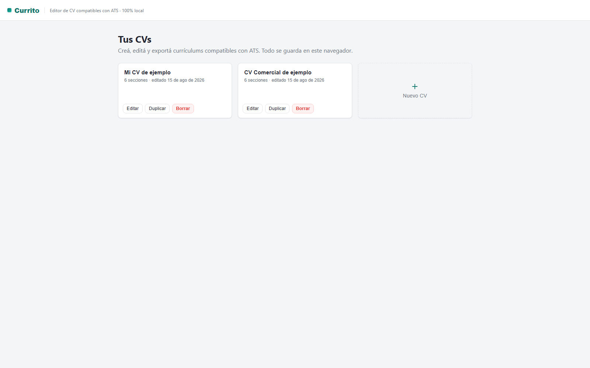
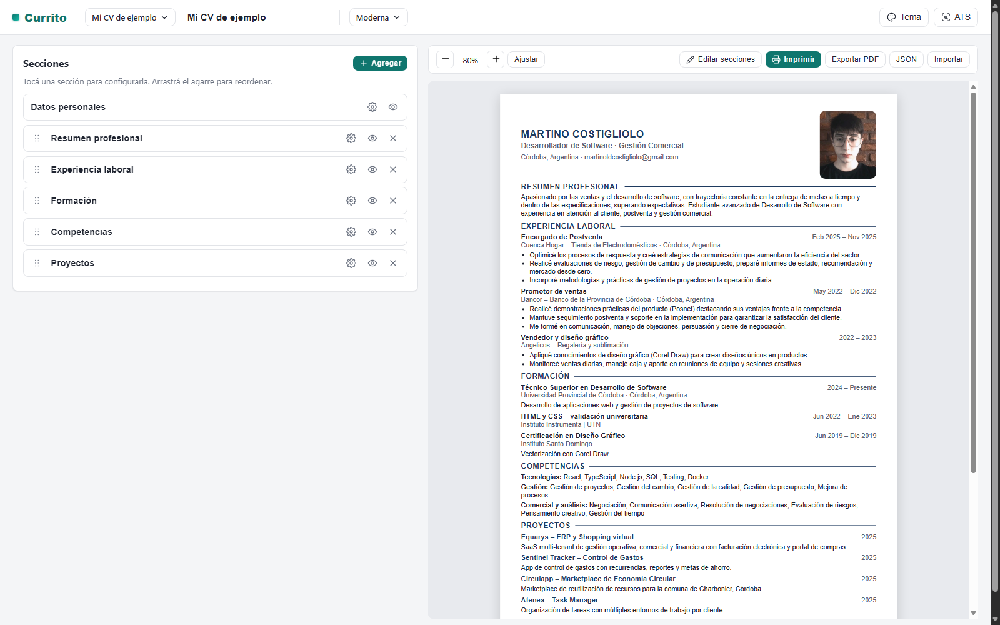
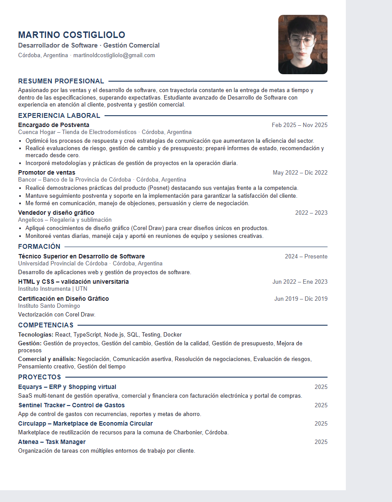

# Currito

[](LICENSE)
[](https://github.com/Martino17x/currito/actions/workflows/ci.yml)
[](https://react.dev)
[](https://vitejs.dev)
[](https://www.typescriptlang.org)

Editor de currículums vitae compatibles con **ATS**, 100% client-side.

Currito te permite crear, editar y exportar CVs que los sistemas de seguimiento de
postulantes (ATS) pueden parsear sin problemas. Todo se guarda en tu navegador
(localStorage): sin cuentas, sin servidores, sin subir tus datos a ningún lado.

## Capturas







## Características

- **ATS-friendly**: texto seleccionable, sin tablas ni gráficos, keywords por sección.
- **3 plantillas**: Moderna, Clásica y Mínima, todas con estilos de títulos configurables.
- **Tema completo**: color de acento, tipografía, tamaño de base, escala de títulos, espaciado.
- **Vista previa en vivo** con zoom por dispositivo (35% móvil / 60% tablet / 80% desktop) y ajuste automático.
- **Foto de perfil** con arrastrar y soltar (se optimiza y se guarda en el navegador).
- **Secciones reordenables** con drag & drop (dnd-kit) y formularios de configuración por sección.
- **Panel ATS checker**: detecta problemas que afectan el parseo del CV.
- **Exportar PDF** (imprime en A4 real, una sola hoja si el contenido entra) y **Exportar/Importar JSON**.
- **100% local**: tus datos nunca salen de tu navegador.
- **Rutas reales** (`/` y `/cv/:id`) con deep-linking, listo para deploy SPA.

## Stack

- [React](https://react.dev) + [TypeScript](https://www.typescriptlang.org)
- [Vite](https://vitejs.dev)
- [Zustand](https://zustand.docs.pmnd.rs) (estado + persistencia en localStorage)
- [React Router](https://reactrouter.com)
- [dnd-kit](https://dndkit.com) (drag & drop)

## Cómo correrlo

Requisitos: [Node.js](https://nodejs.org) 18+ y [pnpm](https://pnpm.io).

```bash
pnpm install
pnpm dev        # servidor de desarrollo (http://localhost:5173)
```

Build de producción:

```bash
pnpm build      # typecheck + build a dist/
pnpm preview    # servir el build localmente
```

Chequeos:

```bash
pnpm typecheck                            # tsc --noEmit
pnpm exec vite build --ssr scripts/smoke.ts --outDir dist-ssr && node dist-ssr/smoke.js
```

## Estructura

```
src/
  components/
    editor/       # formularios de cada sección, photo uploader
    layout/       # header, lista de CVs, builder
    panels/       # tema, ATS checker, export JSON
    preview/      # vista previa + controles de zoom
    templates/    # plantillas (modern, classic, minimal)
    ui/           # primitivas: Select custom, iconos SVG
  data/           # presets de ejemplo + tema por defecto
  hooks/          # useDeviceTier, usePopover
  lib/            # ats, dates, exportPdf, exportJson, fonts
  store/          # zustand: resumeStore (persistido), uiStore
  styles/         # tokens, app UI, template CSS
  types/          # tipos del dominio (Resume, Theme)
```

## Deploy en Vercel

El proyecto incluye `vercel.json` con el framework Vite y las **rewrites de SPA**
(`/(.*) → /index.html`) para que las rutas `/cv/:id` funcionen al recargar o abrir
directo, sin el clásico 404 de Vite en Vercel.

Importá el repo en [vercel.com](https://vercel.com): Vercel detecta Vite solo,
usa `pnpm build` y el output `dist/`.

## Licencia

[MIT](LICENSE) © 2026 Martino Costigliolo
